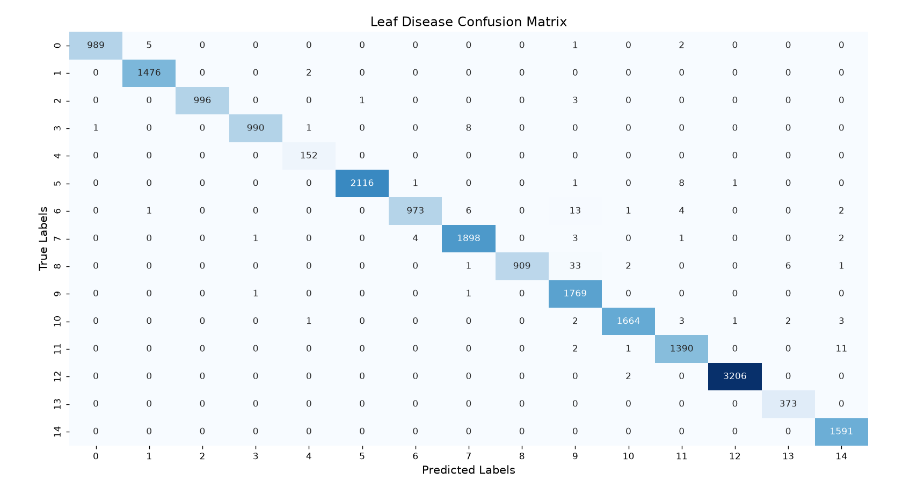

# leafLENS

leafLENS is a computer-vision application that identifies common diseases and
health conditions from images of pepper, potato, and tomato leaves. The
project includes a FastAPI web interface where a user can upload a leaf image
and receive a predicted condition with the model's confidence score.

## Features

- Browser-based leaf image upload.
- Drag-and-drop image selection.
- Prediction of 15 PlantVillage leaf classes.
- Confidence score returned with every prediction.
- FastAPI backend suitable for deployment as a hosted web service.
- ResNet18 image-classification model with pretrained ImageNet features.

## How it works

1. A user opens the web page and selects or drops a leaf image into the
   analysis area.
2. The image is converted to RGB, resized to `224 × 224` pixels, converted to
   a tensor, and normalized using ImageNet channel statistics.
3. The trained ResNet18 model produces class scores.
4. The scores are converted to probabilities, and the highest-probability
   class is returned with its confidence percentage.

The trained weights are stored in [`leaflens.pth`](./leaflens.pth). The model
definition is in [`model.py`](./model.py), and the browser/API integration is
implemented in [`connection.py`](./connection.py).

## Supported classes

The model predicts the following classes:

| Class |
| --- |
| Pepper bell bacterial spot |
| Pepper bell healthy |
| Potato early blight |
| Potato late blight |
| Potato healthy |
| Tomato bacterial spot |
| Tomato early blight |
| Tomato late blight |
| Tomato leaf mold |
| Tomato Septoria leaf spot |
| Tomato spider mites (two-spotted spider mite) |
| Tomato target spot |
| Tomato yellow leaf curl virus |
| Tomato mosaic virus |
| Tomato healthy |

## Model evaluation

The confusion matrix below shows the model's class-level predictions on the
evaluation data. Rows represent the true labels and columns represent the
predicted labels. Strong diagonal values indicate correct predictions, while
off-diagonal values show where the model confused one class with another.

## Project structure

| File or directory | Purpose |
| --- | --- |
| [`connection.py`](./connection.py) | FastAPI application, web page, and image prediction endpoint |
| [`model.py`](./model.py) | ResNet18 model definition |
| [`predict.py`](./predict.py) | Python helper for making a prediction from an image path |
| [`train.py`](./train.py) | Model-training workflow |
| [`datapipeline.py`](./datapipeline.py) | Image transforms and dataset data loader |
| [`leaflens.pth`](./leaflens.pth) | Trained model weights |
| [`confusion_matrix.png`](./confusion_matrix.png) | Evaluation confusion-matrix visualization |
| `PlantVillage/` | Image dataset organized by class |

## Limitations

- Predictions are intended as an assistive indication, not a replacement for
  professional agricultural diagnosis.
- Results depend on image quality, lighting, framing, and whether the leaf
  appears similar to the training data.
- The model cannot predict every type of leaf, plant, or disease. It only
  recognizes the 15 classes listed above, so other plants, diseases, or
  non-leaf images may receive an unreliable prediction.
- Confidence is the model's probability estimate; it is not a guarantee of
  correctness.

## License and dataset attribution

The leaf images used by this project come from the
[Plant Disease dataset on Kaggle](https://www.kaggle.com/datasets/emmarex/plantdisease).
Confirm the applicable dataset and model-weight licenses before redistributing
the dataset or deploying the service publicly.
